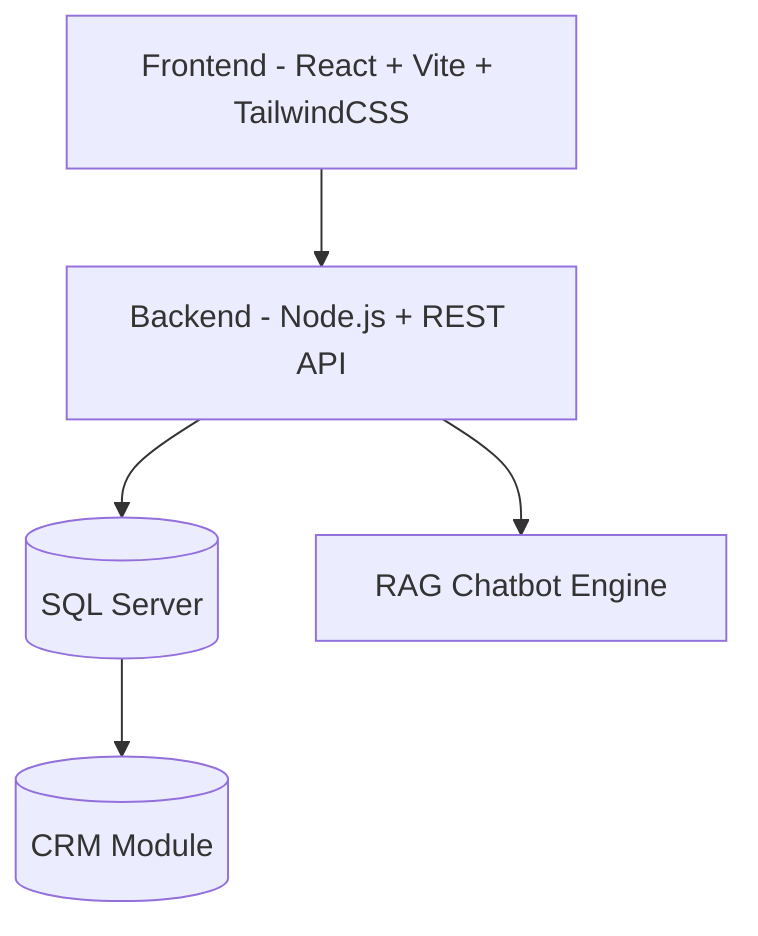

# 🚀 CSKH-system  
**Hệ thống Hỗ trợ Tư vấn & Chăm sóc Khách hàng cho Doanh nghiệp (Bán hàng)**  
<!-- ALL-CONTRIBUTORS-BADGE:START - Do not remove or modify this section -->
[](#contributors-)
<!-- ALL-CONTRIBUTORS-BADGE:END -->
[]()  
[]()  


---

## 📖 Giới thiệu
**CSKH-system** là nền tảng hỗ trợ doanh nghiệp trong lĩnh vực **bán hàng** quản lý và tối ưu hoạt động **tư vấn – chăm sóc khách hàng**.  
Hệ thống giúp tăng trải nghiệm khách hàng, rút ngắn thời gian phản hồi và nâng cao tỷ lệ chuyển đổi.

---

## ✨ Tính năng nổi bật
- 💬 **Chat trực tiếp**: Kết nối khách hàng với nhân viên tư vấn qua chat.  
- 🤖 **Chatbot AI**: Tự động trả lời các câu hỏi thường gặp (FAQ).  
- 📊 **Quản lý khách hàng (CRM)**: Lưu trữ, phân loại và theo dõi lịch sử tương tác.  
- 📈 **Báo cáo & Thống kê**: Phân tích hiệu quả CSKH theo thời gian, nhân viên, kênh.  
- 🔔 **Thông báo tức thì**: Nhắc nhở nhân viên về khách hàng cần chăm sóc.  
- 🌐 **Đa kênh**: Hỗ trợ tích hợp với Zalo, Facebook, Email, Website.  

---

## 🚀 Tech Stack

- **Frontend**: React + Vite + TailwindCSS
- **Backend**: Node.js(Express) + REST-API
- **Database**: SQL Server 
- **Chatbot**: Retrieval-Augmented Generation (RAG)  
- **DevOps**: GitHub Actions + CI/CD
---

## 🏗️ Kiến trúc hệ thống


---
## 🏆 Leaderboard Đóng Góp

🔥 Cùng nhau đua TOP để hệ thống ngày càng xịn hơn!  
*(Dữ liệu sẽ tự động cập nhật sau khi nhiều contributors tham gia)*  

<!-- GITCONTRIBUTOR_START -->
| Rank | Contributor | Commits | PRs | Issues |
|------|-------------|---------|-----|--------|
| 🥇   | [@ThienNguyen666](https://github.com/ThienNguyen666) | 12 | 3 | 1 |
| 🥈   | [@van080105](https://github.com/van080105) | 8 | 2  | 1 |

<!-- GITCONTRIBUTOR_END -->

---

## 👨‍💻 Contributors

Cảm ơn những người đã đóng góp! 💚  
*(Quản lý bằng [all-contributors](https://allcontributors.org))*  

<!-- ALL-CONTRIBUTORS-LIST:START - Do not remove or modify this section -->
<!-- prettier-ignore-start -->
<!-- markdownlint-disable -->
<table>
  <tbody>
    <tr>
      <td align="center" valign="top" width="14.28%"><a href="https://github.com/van080105"><br /><sub><b>van080105</b></sub></a><br /><a href="https://github.com/van080105/CSKH-system/commits?author=van080105" title="Code">💻</a> <a href="https://github.com/van080105/CSKH-system/commits?author=van080105" title="Documentation">📖</a></td>
      <td align="center" valign="top" width="14.28%"><a href="https://github.com/ThienNguyen666"><br /><sub><b>Nguyễn Chí Thiện</b></sub></a><br /><a href="https://github.com/van080105/CSKH-system/commits?author=ThienNguyen666" title="Code">💻</a> <a href="https://github.com/van080105/CSKH-system/commits?author=ThienNguyen666" title="Documentation">📖</a></td>
    </tr>
  </tbody>
</table>

<!-- markdownlint-restore -->
<!-- prettier-ignore-end -->

<!-- ALL-CONTRIBUTORS-LIST:END -->

---

## 🚀 Hướng dẫn cài đặt


### Yêu cầu hệ thống


### Cài đặt nhanh
```bash
# Clone dự án
git clone https://github.com/van080105/CSKH-system.git
cd CSKH-system

# Cài đặt dependencies
npm install

# Cấu hình biến môi trường
cp .env.example .env

# Chạy hệ thống
npm run dev
```
---
## 📊 Roadmap
- Hệ thống Chatbot cơ bản
- Live chat cho nhân viên CSKH
- Tích hợp CRM nâng cao
- AI gợi ý kịch bản tư vấn thông minh
- Tích hợp thêm kênh (Zalo OA, Email Marketing, SMS)
  
---

## 🤝 Đóng góp
Mọi ý tưởng, tính năng mới hoặc báo lỗi đều được chào đón!
Vui lòng tạo Pull Request.

## 📜 Giấy phép
Dự án được phân phối theo giấy phép MIT.
Xem chi tiết tại file [LICENSE](./LICENSE)

## Thông tin liên lạc
- 🌍 Website: đang cập nhật...

- 📧 Email: đang cập nhật...

- 💬 Hotline: đang cập nhật...